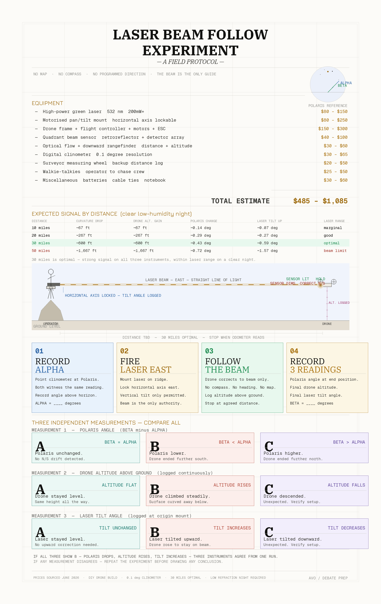

# Earth Curvature & Horizon Simulator

A single-file, dependency-free web app that renders the geometry of the horizon and
how distant targets are progressively hidden by the curvature of the Earth — at true
1:1 scale, with selectable atmospheric refraction.

**Live:** open `index.html` in any modern browser (or enable GitHub Pages on this repo).

## Features

- **Side view & observer view** — switch between a true-to-scale cross-section and a
  through-the-lens view of what an observer actually sees.
- **True 1:1 scale** — no vertical exaggeration. Zoom and pan to inspect detail.
- **Telescopic observer view** — set focal length and sensor size; the view behaves like
  a real camera lens (FOV, magnification), with tilt up/down.
- **Atmospheric refraction** — selectable coefficient *k* (geometric, standard, typical
  visual, strong, inversion) or manual entry, modeled via the effective-radius method
  R' = R / (1 − k).
- **Ray-traced refraction** — optional alternative to the constant-*k* model: integrates the
  real light path through a layered air profile (standard, inversion/ducting, or surface
  mirage), draws the bent ray in the side view, and reports the ray-traced hidden height
  beside the effective-radius value. The standard profile overlays the constant-*k* sight
  line; the duct and mirage profiles reproduce looming, ducting, and inferior mirages.
- **Hidden vs. visible** — the obstructed portion below the horizon is drawn in red; the
  visible portion above in the target color, with callouts for distance, height, hidden
  amount, horizon distance, bulge, and dip.
- **Target types** — mountain, lighthouse, boat/ship, building, wind turbine, oil
  platform, or custom, each drawn to scale.
- **Multiple targets** — selected observations (e.g. the Lake Pontchartrain transmission
  towers, the Black Swan oil rigs) render a receding line of identical targets, each
  base sinking progressively below the horizon.
- **Famous observations** — built-in presets for well-documented long-distance sightings
  (Chicago skyline across Lake Michigan, Toronto across Lake Ontario, Turning Torso,
  Canigou from Marseille, O'ahu from Kaua'i, Finestrelles → Pic Gaspard 443 km, Pyrenees
  → Alps, Denali, and more).
- **Earth model** — mean sphere (R = 6,371 km) or WGS84 oblate spheroid (geocentric
  radius by latitude).
- **Refraction bands** — overlay line-of-sight at multiple *k* values to show the range.
- **Visibility / haze limit** — optional Koschmieder air-clarity cutoff.
- **Terrain & sea state** — optional intervening obstacle (a hill or ridge at a set
  distance and height) and wave height. Whichever of the Earth horizon, the wave crests,
  or the obstacle grazes the line of sight highest sets the hidden amount, and the result
  panel reports which one is the limiter.
- **Methodology** — collapsible section with the governing formulas, live worked
  calculations for the current scene, citations, and a glossary.

## Math

| Quantity | Formula |
| --- | --- |
| Effective radius | R' = R / (1 − k) |
| Horizon distance | d₁ = √(h² + 2·R'·h) |
| Hidden height | h₁ = √(d₂² + R'²) − R',  d₂ = d₀ − d₁ |
| Bulge | B = R'·(1 − cos(d / 2R')) |
| Horizon dip | dip = arccos( R' / (R' + h) ) |
| Haze contrast (Koschmieder) | C = exp(−3.912·d / V) |

## Usage

No build step and no dependencies. Either:

- Open `index.html` directly, or
- Serve the folder: `npx serve .` and visit the printed URL.

## Field protocol

A companion field protocol, the **Laser Beam Follow Experiment**, sketches a
reproducible real-world drone-and-laser test of the same geometry the Laser Test
view models: a drone follows a horizontal laser beam while three independent
instruments (Polaris angle, drone altitude above ground, and laser tilt)
cross-check what the surface did beneath the beam.

- **Interactive page:** [`laser-experiment.html`](laser-experiment.html) ([live](https://mutiny19.github.io/curvhorizon/laser-experiment.html)) — equipment, setup diagram, procedure, and how to handle refraction, with expandable detail on each section.
- **Poster version:**

## License

This project is **dual-licensed**:

- **Open source:** [GNU AGPL-3.0](LICENSE). Free to use, modify, and self-host,
  provided that if you run a modified version as a network service you make your
  source available under the same license.
- **Commercial:** if the AGPL's terms do not suit your use (closed-source
  products, proprietary SaaS, resale, etc.), a separate commercial license is
  available. See [`COMMERCIAL-LICENSE.md`](COMMERCIAL-LICENSE.md).

Copyright (c) 2026 mutiny19.

## Acknowledgements

Inspired by Andy Cook's (dizzib) MIT-licensed
[earth curve calculator](https://github.com/dizzib/earthcalc). This is an
independent implementation; no source from that project is included.
