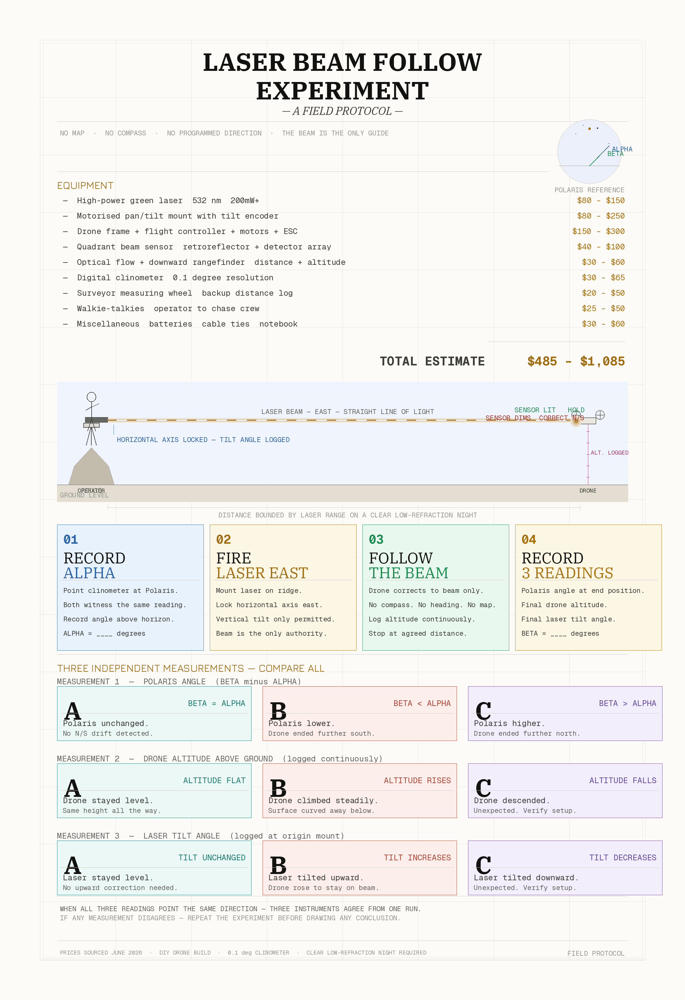

# Results & replication log

Plots, photos, and the narrative read of each run live here. Raw runs live under
[`../data/`](../data/), one subfolder per run named `YYYY-MM-DD_contributor/`.

The interactive field protocol ([`../laser-experiment.html`](../laser-experiment.html))
and the curvature simulator ([`../simulator.html`](../simulator.html)) are the
build-and-read references; this log is where measured runs are recorded.

`status` in `metadata.yml` is **untested** until at least one clean run is logged
below. A refuted or inconclusive run is a real result — log it.

## Replication log

| Date | Contributor | Site / distance | Conditions (k, weather) | Outcome | Data | Notes |
|---|---|---|---|---|---|---|
| — | — | — | — | _none yet_ | — | awaiting first run |

